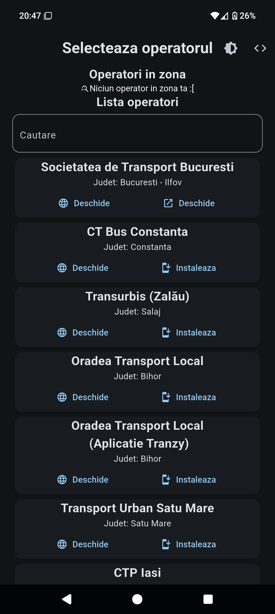

# MoveRo
MoveRo is an open source mobile app which aims to help Moblility in Romania by agregating all oficial public transportation apps and sites and showing them to the user starting with those closest to the user.

## Adding new operators

For adding new operators [check out the quick instructions](https://github.com/FloreaCostinMario/MoveRo/blob/main/ADD_OPERATORS.md)

## Contribute

 If you want to help by adding more operators, features or bug fixes, feel free to [create an pull request.](https://github.com/FloreaCostinMario/MoveRo/pulls)

 If you would like to report an issue, please use the [issue tracker](https://github.com/FloreaCostinMario/MoveRo/issues) on GitHub.

# Disclaimer

The names and the websites shown in the app are the intelectual property of their own respective operators. If you wish to have your company removed or site removedd please [file an issue here](https://github.com/FloreaCostinMario/MoveRo/issues)